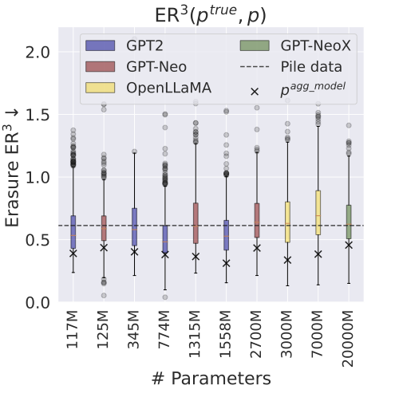

# Geographical Erasure in Language Generation

This repository contains code to reproduce the results from [Geographical Erasure in Language Generation](https://www.amazon.science/publications/geographical-erasure-in-language-generation) by Schwöbel et al., from EMNLP 2023 Findings. The goal of this work is to study and operationalise a form of geographical erasure, wherein language models underpredict certain countries.

## Installation
The package is developed under python 3.9 using torch 1.13.1. 
To install the package you can create a conda environment via `conda create -n geographical_erasure_env python=3.9`. Activate the environment and `pip install torch==1.13.1`.
Then clone this repository and install the requirements as `pip install -r requirements.txt`. Lastly, install the package itself by running `pip install -e .` from within the folder. 

## Usage

### 1. Reproducing the paper 
The scripts to reproduce the paper results are in the `scripts/` folder, visualisation notebooks in `notebooks/`.
For example, run `bash size_experiment.sh` to produce the results for Fig.5, left, and visualise the results with `notebooks/paper_plots_exp4_2.ipynb`.

### 2. Library usage
The core functionalities to probe language models live in `geographical_erasure.probe_lm.py`. The code in this file is optimised for interpretability, not speed. For example, `compute_population_probs` computes $p$(`country` |`prompt`) for each candidate `country` using a for-loop. 

A batched, GPU-optimsed implementation of the same functions can be found in `distribution_model.py` and `prompt_dataset.py`. 

## Security

See [CONTRIBUTING](CONTRIBUTING.md#security-issue-notifications) for more information.

## License

This project is licensed under the Apache-2.0 License.

